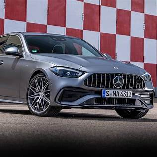

# Most popular

{ width="100"}
{ width="100"}
{ width="100"}
{ width="100"}

As of 2024, the most popular Mercedes-Benz C-Class model in the UK is the **C 300 e**, a plug-in hybrid electric
vehicle (PHEV). This model has been recognized for its blend of performance and efficiency, winning the **What Car?
Hybrid Car of the Year 2024** award .([Mercedes-Benz][1])

### Why the C 300 e Stands Out

* **Hybrid Powertrain**: Combines a petrol engine with an electric motor, offering the flexibility of electric-only
  driving for short trips and the range of a petrol engine for longer journeys.

* **Fuel Efficiency**: Delivers impressive fuel economy, making it an attractive option for those looking to reduce
  running costs.

* **Tax Benefits**: As a PHEV, it benefits from lower Vehicle Excise Duty (VED) rates compared to standard petrol or
  diesel models.

* **Environmental Impact**: Offers reduced CO₂ emissions, appealing to environmentally conscious drivers.

For those interested in a fully electric option, Mercedes-Benz also offers the **EQC** and **EQA** models, which provide
zero-emission driving experiences.

If you're considering a C-Class, the C 300 e presents a compelling balance of performance, efficiency, and tax
advantages, making it a popular choice among UK buyers.([Mercedes-Benz][1])

[1]: https://www.mercedes-benz.co.uk/passengercars/models/saloon/c-class/overview.html?utm_source=chatgpt.com "C-Class Saloon | Mercedes-Benz"
